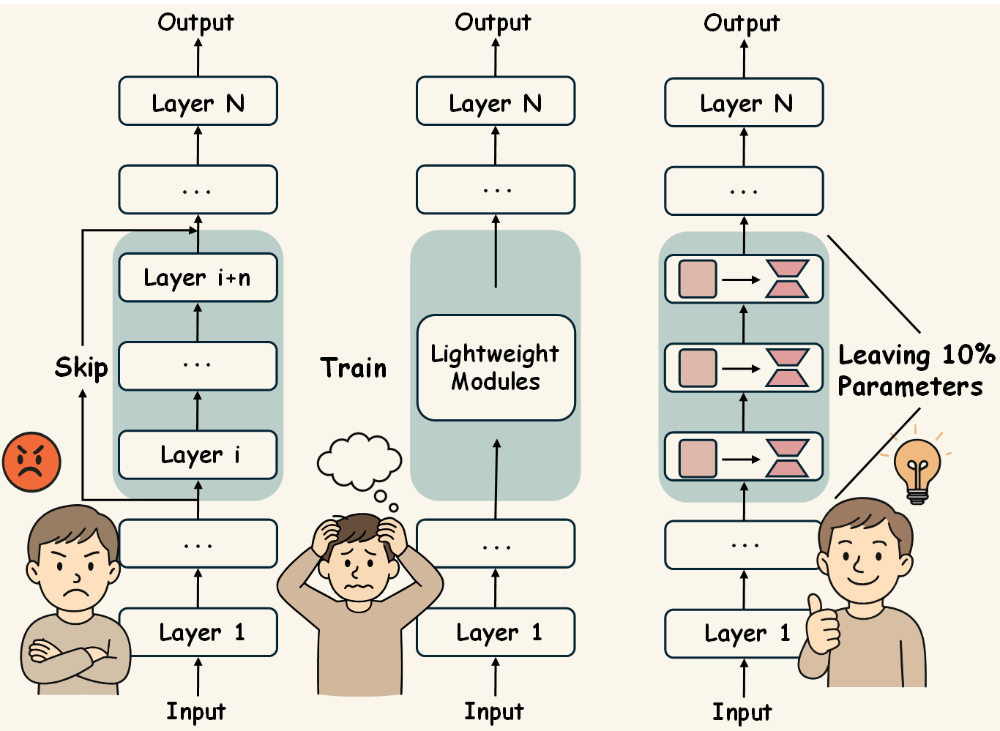

<p align="center">
<h1 align="center">GRASP: Replace Redundant Layers with Adaptive Singular Parameters for Efficient Model Compression

<p align="center">
    <a href="https://arxiv.org/abs/2501.00339"></a>
    <a href="https://github.com/LyoAI/GRASP/blob/main/LICENSE"></a>
</p>


## 🔍Overview
Recent studies have demonstrated that many layers are functionally redundant in large language models (LLMs), enabling model compression by removing these layers to reduce inference cost. While such approaches can improve efficiency, indiscriminate layer pruning often results in significant performance degradation. In this paper, we propose **GRASP**, a novel compression framework that mitigates this issue by preserving sensitivity-aware singular values. Unlike direct layer pruning, GRASP leverages gradient-based attribution on a small calibration dataset to adaptively identify and retain critical singular components. By replacing redundant layers with only a minimal set of parameters, GRASP achieves efficient compression while maintaining strong performance with minimal overhead. 
 



## 📊 Evaluation Results

| Model           | Openb. | ARC_e | WinoG. | HellaS. | ARC_c | PIQA | MathQA | Average |
| --------------- | ------ | ----- | ------ | ------- | ----- | ---- | ------ | ------- |
| LLaMA-7B        | 0.28   | 0.67  | 0.67   | 0.56    | 0.38  | 0.78 | 0.27   | 0.52    |
| **GRASP-5.5B**  | 0.22   | 0.52  | 0.64   | 0.43    | 0.32  | 0.70 | 0.24   | 0.44    |
| **GRASP\*-5.5B** | 0.24   | 0.59  | 0.63   | 0.50    | 0.35  | 0.73 | 0.25   | 0.47    |
| LLaMA2-7B       | 0.32   | 0.69  | 0.67   | 0.57    | 0.40  | 0.78 | 0.28   | 0.53    |
| **GRASP-5.5B**  | 0.24   | 0.54  | 0.63   | 0.43    | 0.33  | 0.71 | 0.23   | 0.44    |
| **GRASP\*-5.5B** | 0.28   | 0.61  | 0.65   | 0.50    | 0.36  | 0.72 | 0.25   | 0.48    |

- **GRASP** denotes compressing dense model without post-training for recovery
- **GRASP*** denotes compressing dense model with post-training on Alpaca dataset for 1 epoch


## 🎯Quick Start

### 🔗Clone this repo

```sh
git clone https://github.com/LyoAI/GRASP.git
cd GRASP
```

### ⚙️Install dependencies

```sh
# step 1: create a virtual environment
conda create -n grasp python=3.9

# step 2: activate the virtual environment
conda activate grasp

# step 3: install dependencies from requirements.txt
pip install -r requirements.txt
```

### ✂️GRASP Compress

1. 🔧 **Adjust the parameters in `scripts/params_script.sh` to fit your needs.**
   - **MODEL_NAME_OR_PATH**: Specifies the path or name of the pre-trained model to be used.
   - **DATASET_NAME**: Indicates the name of the dataset to be used for calibration.
   - **NUM_PRUNE_LAYERS**: Defines the number of redundant layers to be pruned from the model.
   - **COMPRESSION_RATIO**: Sets the target compression ratio for the redundant layers.
   - **NUM_SAMPLES**: Specifies the number of samples to be used for calibration.

2. ▶️**Run the GRASP Scripts:**

   ```bash
   bash scripts/run_grasp.sh
   ```


## 📐Evaluation

**To evaluate the model, use the following script:**

```bash
bash scripts/run_evaluate.sh
```


## 📌Citation

**If you find the repository or paper helpful, please cite our work:**

```
@article{liu2024grasp,
  title={GRASP: Replace Redundant Layers with Adaptive Singular Parameters for Efficient Model Compression},
  author={Liu, Kainan and Zhang, Yong and Cheng, Ning and Li, Zhitao and Wang, Shaojun and Xiao, Jing},
  journal={arXiv preprint arXiv:2501.00339},
  year={2024}
}
```

## ⭐ Star History
[](https://star-history.com/#LyoAI/GRASP&Date)